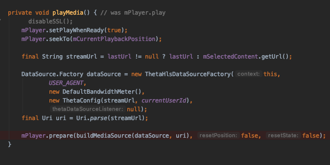
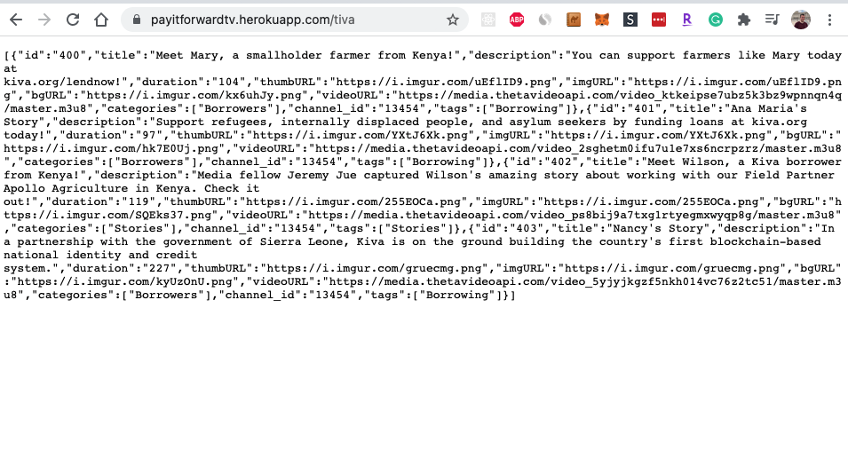

 
 

 
 

TiVa
---

TiVa is a crypto-powered application inspired by Kiva.org for giving microloans for individuals and businesses in need.

Built for the Theta 2021 hackathon going after the General and Streaming Video categories.

<b>Note this project is currently for demo purposes and would require additional implementation to be production ready.</b>

<!-- 
Demo script:

* App
* Theta wallet and QR code scan (record from device)
* Github

-->

## Introduction

Largely to this point, the ThetaTV ecosystem has focused on gamers. TiVa expands the audience of streamers to include businesses and entreprenuers in need. The TiVa Android TV application brings the innovative charitable lending of Kiva and Theta streams into your living room and allows instant lending right from your remote or mobile device. 

TFuel can also be donated to the streamers or entrepreneurs.

## Running the app
* Download and open <a href="https://developer.android.com/studio" target="_blank">Android Studio</a>.
* Clone repo and open as android project.
* Build gradle dependencies.
* Run app on AndroidTV emulator or device (minSdk: 22).

## How it's built
* <a href="https://www.thetavideoapi.com/" target="_blank">Theta Video API</a>

The Theta Video API is called ahead of time to convert any static media into streamable files. For this example, we converted the charitable

* <a href="https://github.com/thetatoken/theta-protocol-delivery-android-sdk-lib">Theta Delivery SDK</a>

The Theta delivery SDK is added to offer support for playing streams within the application. The library `delivery-sdk.arr` is added as an imported and initialized module within the TiVa application.

<b>Note this project is currently for demo purposes and would require additional implementation to be production ready.</b>

## Objective
With TiVa, our primary objective was to find ways to expand upon ThetaTV already a successful platform for allowing charitable lenders to change the lives of borrowers all over the world by utilizing 10ft platforms and cryptocurrencies to borrower visibility, borrower connections, fund distribution, loan impact, and lender engagement.

**Borrower Visibility**
By bringing charitable lending to 10ft devices we hope to reach an audience that may not yet know about the concept or its benefits. This can be achieved by allowing advertising through TV and Video streaming platforms and apps to bring viewers directly to the TiVa charitable lending app without leaving the TV. The TiVa app could also be useful for introducing charitable lending to others who might be watching TV along with a lender, as TV devices are more often viewed by multiple people as once within a household and are likely to be placed in public settings. It provides lenders a convenient way to share their experience with friends and family in a more meaningful and engaging way than sending links in messages and posts. 

**Fund Distribution**
In order to simplify the transaction process and reduce some of the common challenges with making payments on a 10ft platform, TiVa makes cryptocurrency payments available through a QR code which can be read and processed with any of several mobile apps available in the app store. This eliminates the need for any text entry using a remote and doesn't tie payments to the account of the TV's owner. Using cryptocurrencies, also makes all transaction information available on the blockchain aiding in tracking and accounting for loan payments.

**Borrower Connections**
Allowing borrowers to upload videos for viewing on 10ft platforms gives them an opportunity to bring viewers and potential lenders closer into their lives and struggles to give lenders a better understanding of the impact a loan would have. By encouraging borrowers to add video updates after receiving and utilizing loans, we hope to reward lenders with positive uplifting viewing experiences that will encourage further use of the app and lending platform. 

**Loan impact**
The TiVa app is configured to encourage loan cycling, instead of returning loan payments back to the lender, they may be paid directly to another borrower selected by the lender. Users familiar with watch list functionality common on 10ft apps, can use the same procedures for creating a loan list. As loans are cycled through borrowers, each time a borrower uploads a video update, it gets added to the lenders' past loan list providing a convenient way to review the total impact that a single loan has made on all of its borrowers.

**Lender Engagement**
The TiVa app uses various techniques designed to provide engaging borrower video browsing and viewing experiences with the goal of persuading viewers to lend to borrowers. Categorized carousels help lenders browse through borrowers that they may have strong connections to, recommendations can be made based on urgent borrower needs or based on a lender's past browsing or lending history. 

## Screenshots

<h3>TiVa uses the Theta delivery sdk to stream borrower / entrepreneur videos in a TV app format</h3>

<h3>The Theta API is called to convert any mp4 into a streamable file</h3>

